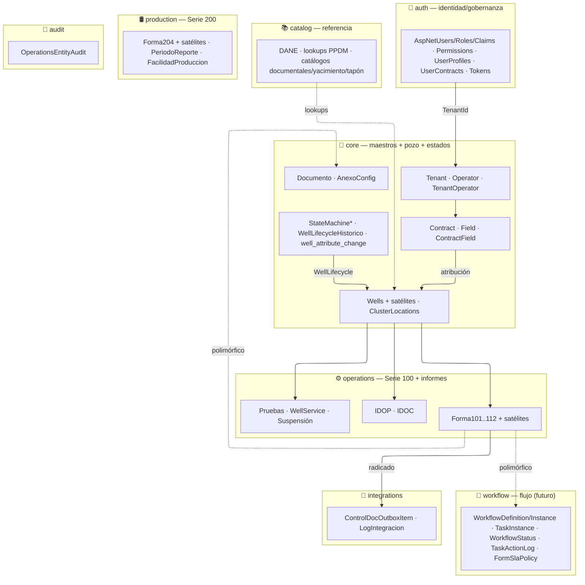
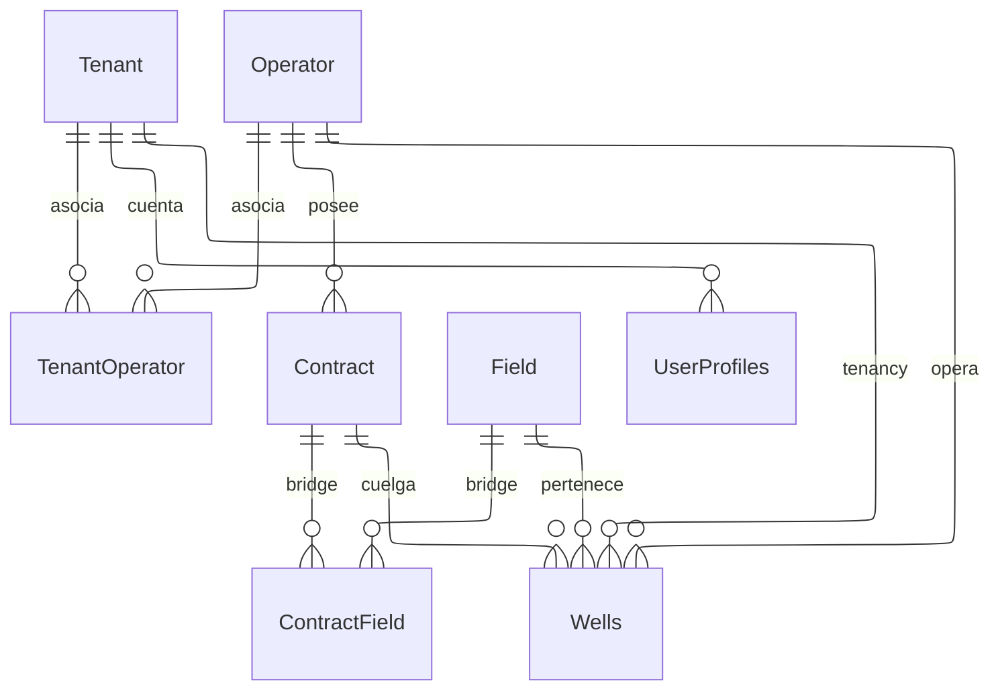
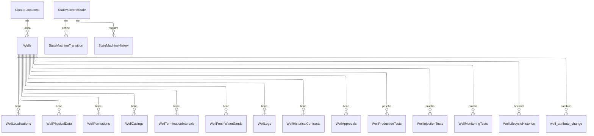
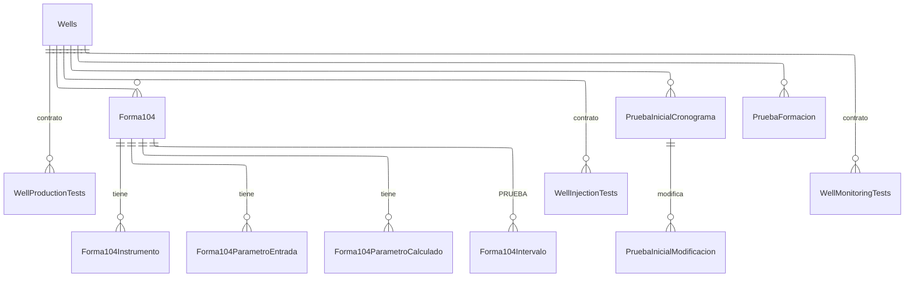
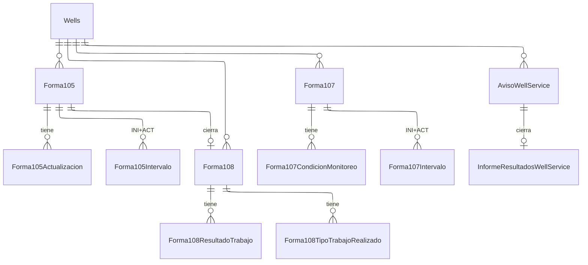
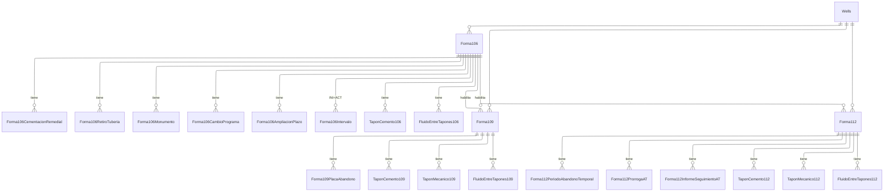
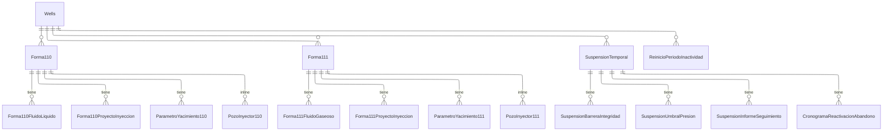
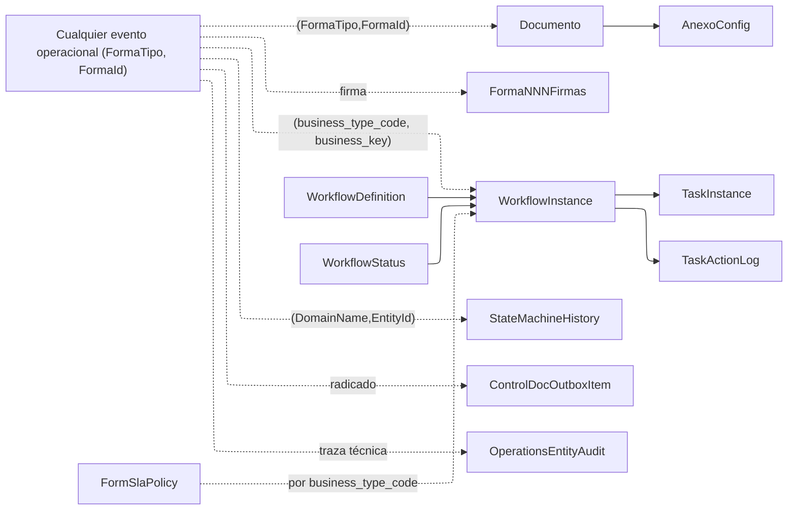
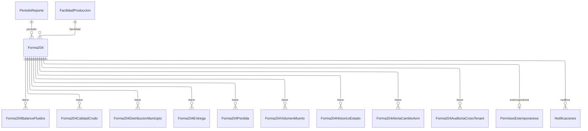

# Diagrama ER — Operaciones GOP360 (entidades y esquemas)

**Versión:** 0.3 (iterable) — `erDiagram` + ELK (aristas ortogonales 90°)
**Fecha:** 2026-07-01

**Alcance:** Propuesta Inicial de modelamiento de entidades de datos (sin atributos ni columnas), esta propuesta puede cambiar y es iterable conforme se identifiquen cambios en el levantamiento y aprobacion de los requerimientos funcionales por parte de ANH los cuales se encuentran en proceso de validacion e iteración.

> **Notación:** Mermaid `erDiagram` con **layout ELK** (`config: layout: elk`). Diagramas por dominio para legibilidad.
>
> ⚠️ **Requiere Mermaid v11+ con ELK** (GitHub y mermaid.live lo soportan; en VS Code exige la extensión con motor ELK). Si tu preview no lo soporta, el bloque puede no renderizar — en ese caso quita el frontmatter `config/layout: elk` o usa la v0.2 (flowchart recto).

---

## 1. Mapa de esquemas (alto nivel)

---

## 2. Cuenta y datos maestros (`core`)

---

## 3. Pozo y máquina de estados (`core`)

> `StateMachineHistory`/`Transition` operan por `DomainName` (`WellLifecycle`, `Forma101`, `Forma204`) + `EntityId` — vínculo **polimórfico** (§9). `WellLifecycle` gobierna el estado del pozo; los dominios de forma son pre-workflow.

---

## 4. Apertura — F101, F102, F103 e informes diarios (`operations`)

```mermaid
---
config:
  layout: elk
---
erDiagram
  Wells ||--o{ Forma101 : ""
  Forma101 ||--o{ Forma101Formaciones        : tiene
  Forma101 ||--o{ Forma101Laterals           : tiene
  Forma101 ||--o{ Forma101Revestimientos     : tiene
  Forma101 ||--o{ Forma101PermisosEspeciales : tiene

  Wells ||--o{ Idop : ""
  Idop ||--o{ IdopFaseBroca           : tiene
  Idop ||--o{ IdopFormacionEncontrada : tiene
  Idop ||--o{ IdopInflujoPerdida      : tiene
  Idop ||--o{ IdopRevestimiento       : tiene
  Idop ||--o{ IdopRegistroElectrico   : tiene
  Idop ||--o{ IdopEventoHSE           : tiene

  Wells ||--o{ Idoc : ""
  Idoc ||--o{ IdocRegistroCorrido : tiene
  Idoc ||--o{ IdocIntervalo       : cañoneos
  Idoc ||--o{ IdocEstimulacion    : tiene

  Wells ||--o{ Forma102 : ""
  Forma102 ||--o{ Forma102Broca               : tiene
  Forma102 ||--o{ Forma102FormacionEncontrada : tiene
  Forma102 ||--o{ Forma102PropiedadLodo       : tiene
  Forma102 ||--o{ Forma102RegistroElectrico   : tiene
  Forma102 ||--o{ Forma102Revestimiento       : tiene
  Forma102 ||--o{ Forma102Cementacion         : tiene
  Forma102 ||--o{ Forma102PruebaIntegridad    : tiene

  Wells ||--o{ Forma103 : ""
  Forma103 ||--o{ Forma103FormacionRegistro : tiene
  Forma103 ||--o{ Forma103ArenaAguaDulce    : tiene
  Forma103 ||--o{ Forma103Muestra           : tiene
  Forma103 ||--o{ Forma103Intervalo         : INICIAL
  Forma103 ||--o{ WellProductionTests       : prueba
  Forma103 ||--o{ WellInjectionTests        : prueba
```

> IDOP→F102 e IDOC→F103 son **consolidación** (el diario es la fuente; DA-6).

---

## 5. Técnicas y pruebas — F104, Pruebas Iniciales (`operations` / `core`)

---

## 6. Post-terminación — F105, F107, F108, Well Service (`operations`)

---

## 7. Abandono — F106, F109, F112 (`operations`)

> Los `Tapon*`/`FluidoEntreTapones*` comparten **contrato de columnas** (§8.2) pero son **tablas por-forma** (P-8); el intervalo va **inline** en `TaponCemento*`.

---

## 8. Inyección y Suspensión (`operations`)

---

## 9. Transversales y vínculos POLIMÓRFICOS

Se relacionan con **cualquier forma/evento** por par polimórfico (no FK). Hub central (flowchart + ELK, aristas punteadas = no-FK).

> - `Documento` = **única tabla polimórfica** de datos de negocio (PD-2); `AnexoConfig` se referencia por FK tipada.
> - El **flujo de la forma** vive en `workflow` (futuro); vínculo `(business_type_code, business_key)`.
> - `StateMachineHistory` (dominios de forma) es **pre-workflow** → migrará al Track B.

---

## 10. Producción (Serie 200 — contexto, `production`)

---

*v0.3 — Vista ER a nivel de entidades/esquemas de todo el modelo de Operaciones. Modelo Iterable. La definicion tecnica de las columnas se desarrollaroan conforme al desarrollo de cada especificación una vez aprobada*
